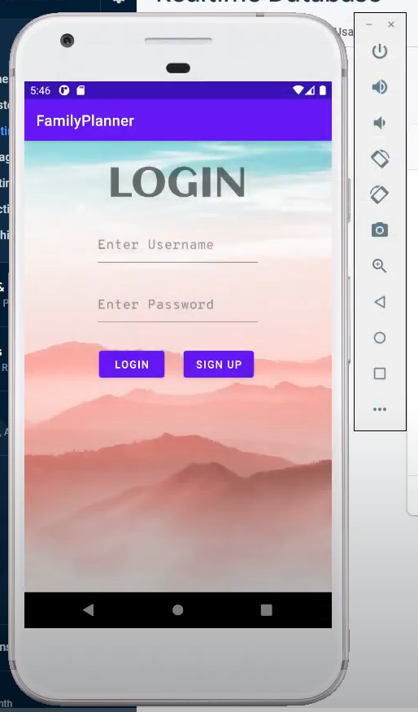
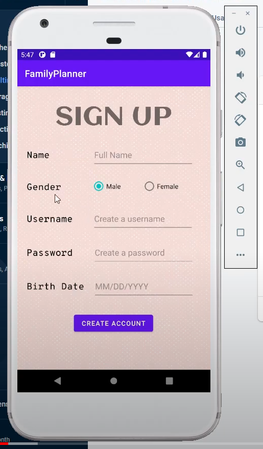
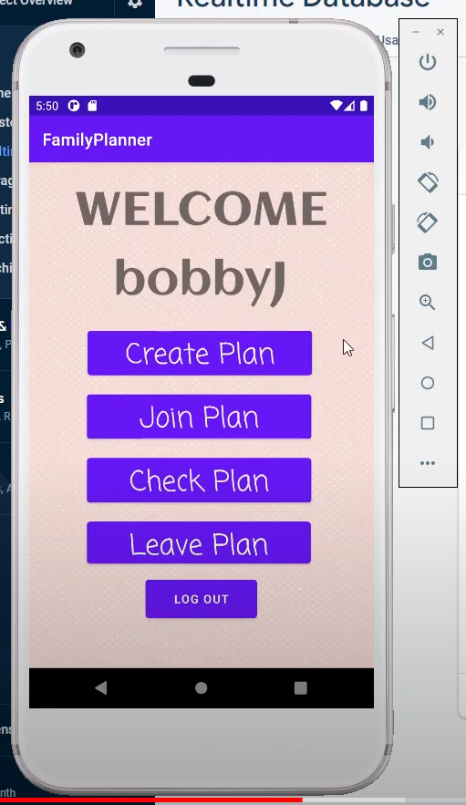
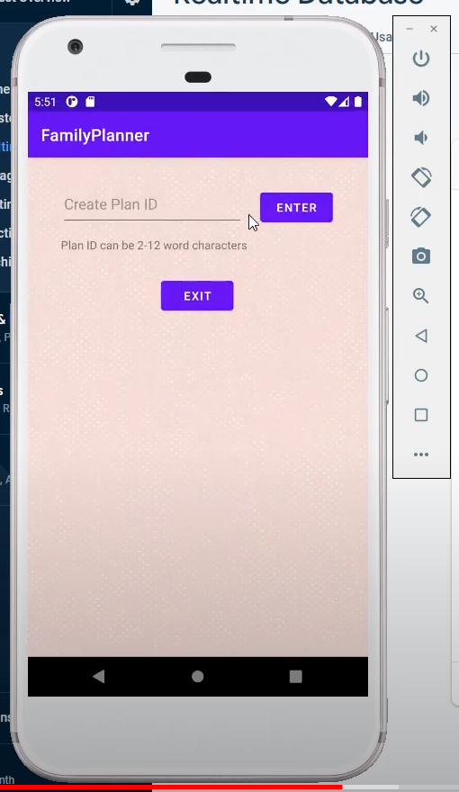
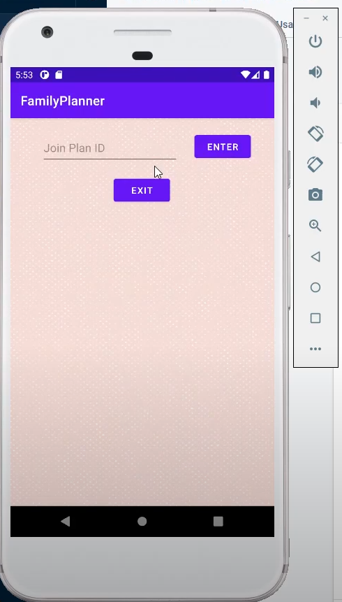
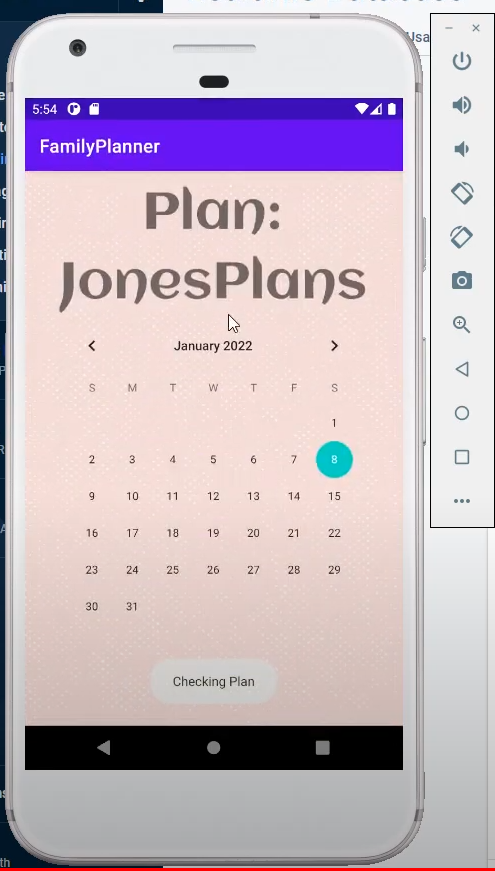
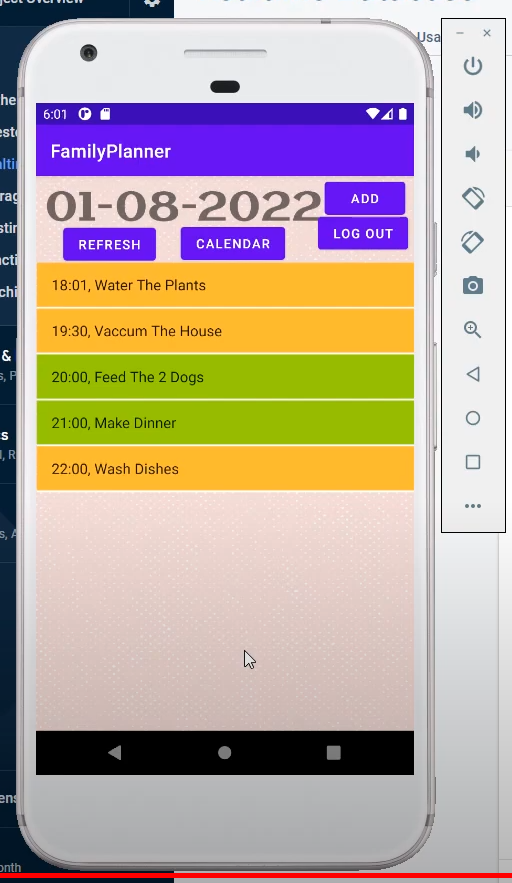
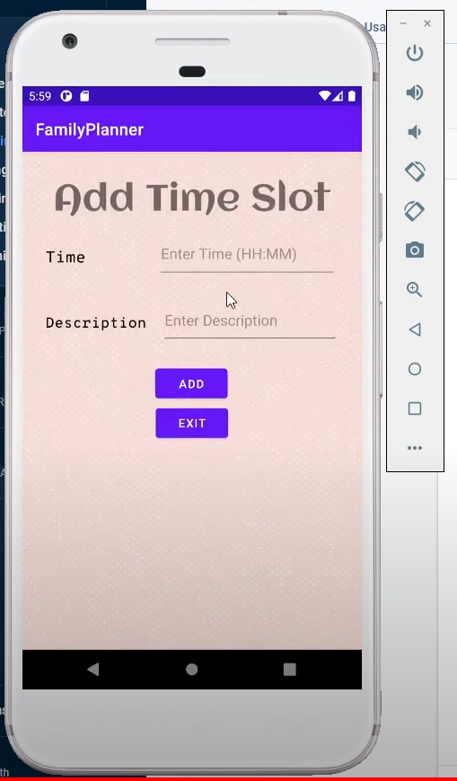
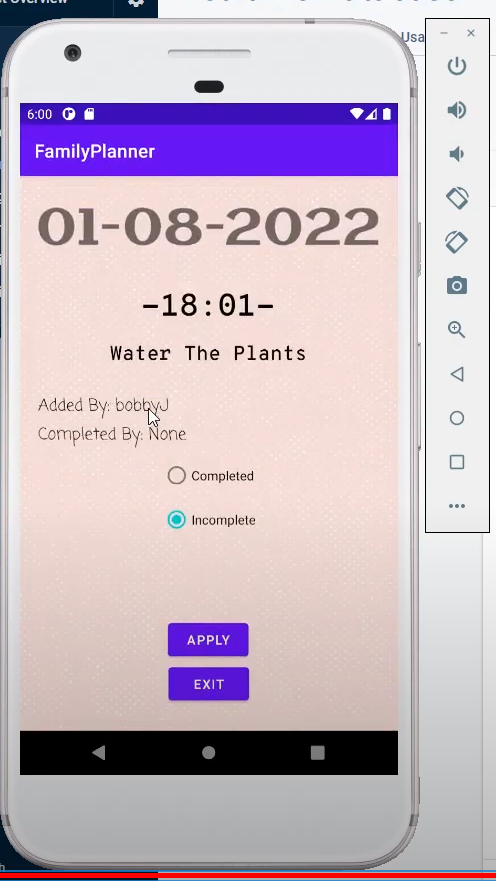

# FamilyPlanner
 This is a family planner app created using Android Studio and uses the database from Firebase. Here is a demo showing the app: https://youtu.be/LyHQz_6ORtA

Below is the login screen:

Below is the sign up screen:

Below is the home screen:

Below is the create new plan screen:

Below is the join new plan screen:

Below is the calendar screen allowing the family members(users) to go to a specific date and add their to-do list:

Below is the screen allowing the family members(users) to see and interact with their to-do list:

Below is the screen allowing the family members(users) to add specific task to their to-do list:

Below is the screen allowing the family members(users) to the details of a task and marking it as complete if they wish:

